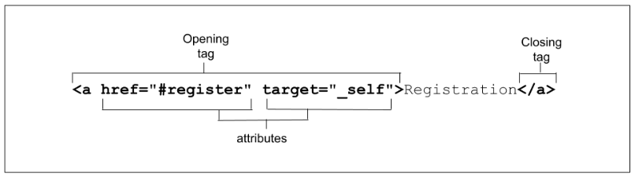

###### Likelion Front-end School

# HTML/CSS

[실습 예제 보기](https://jjmullan.github.io/learn-html-css/)

## 목차

###### HTML

0. [Github](#0-github)

   협업 환경 세팅하기 <br />
   git clone <br />
   git pull <br />
   npm i

1. [HTML 개요](#1-html-개요)

   Hyper Text Markup Language 란 <br />
   &lt;tag&gt; 구성요소 <br />
   HTML 문서 구조

2. [HTML 제목과 단락](#02-html-제목과-단락)

   &lt;h1&gt; ~ &lt;h6&gt; <br />
   &lt;p&gt;

3. [HTML 이미지와 피규어]()

   &lt;image&gt; <br />
   &lt;figure&gt;

4. [HTML 하이퍼링크]()

   &lt;a&gt; <br />

5. [HTML 순서형, 비순서형 목록]()

6. [HTML 정의형 목록]()

7. [HTML 프레이징 요소]()

8. [HTML 인용문과 줄바꿈]()

9. [HTML 테이블]()

10. [HTML 컨테이너 요소]()

11. [HTML section, main 요소]()

12. [HTML 텍스트 레벨 요소]()

13. [HTML address 요소]()

14. [HTML picture, source 요소]()

15. [HTML video, track 요소]()

16. [HTML iframe, object 요소]()

17. [HTML map, area 요소]()

18. [HTML form (input) 요소 - 1]()

19. [HTML form (input) 요소 - 2]()

20. [HTML form (button) 요소]()

21. [HTML form (select, textarea) 요소]()

22. [HTML dialog 요소, popover 속성]()

23. [HTML details, summary 요소]()

24. [HTML script 요소]()

###### CSS

1. [CSS 기초](#1-css-기초)

<br />
<br />
<br />
<br />

###### 2025-02-12

## 0. Github

### 0-1. 협업 환경 세팅하기

**스크럼 리더** _scrum leader_ 는 원활한 협업 환경 세팅을 위해 [필요한 package 를 devDefendency 로 설치](#devdefendency-로-package-설치하기)하고(e.g. live-server, prettier) [package.json](#packagejson-작성-예시), [.gitignore](#gitignore-작성-예시), .prettierrc.cjs 등 필요 환경 세팅을 완료한 뒤, github repository 를 생성, push 해두어야 한다.

```bash
# devDefendency 로 package 설치하기

npm install {패키지명} --save-dev
npm i {패키지명} -D
```

<br />

```javascript
// .package.json 에서 live-server, prettier 관련 설정값 작성 예시

{
  "scripts": {
    "start": "live-server . --port=3000 --host=localhost --no-browser",
    "format": "prettier . --check"
  },
  "devDependencies": {
    "live-server": "^1.2.2",
    "prettier": "^3.5.0"
  }
}
```

```bash
# .gitignore 작성 예시

# Node.js 관련
node_modules/   # npm 패키지 폴더 (용량 많음) -> npm i 로 패키지 관리로 재설치 가능
dist/           # 빌드 결과물
.env            # 환경 변수 파일 (API 키, DB 비밀번호 등 보안 중요)

# 운영체제 & 편집기 관련
.DS_Store       # macOS의 숨김 파일
Thumbs.db       # Windows의 썸네일 캐시 파일
*.swp           # Vim 편집기 임시 파일
.idea/          # JetBrains IDE 설정 폴더
.vscode/        # VS Code 설정 폴더

# 로그 & 임시 파일
*.log           # 로그 파일
npm-debug.log*  # npm 디버그 로그
yarn-debug.log* # Yarn 디버그 로그
yarn-error.log* # Yarn 에러 로그

# 임의 파일 또는 파일 형식을 지정할 수 있다
test.html
*.js
```

```bash
# package.json 의 "scripts" 사용 예시
npm start
npm run format
```

<br />

모든 환경 설정이 완료된 후, github repository 에 push 한다.

```bash
git push

# 저장소 별칭(origin), 브랜치명(main) 을 지정할 수 있다
git push origin main
```

<br />

### 0-2. git clone : Github repository 가져오기

팔로워는 git clone 명령어를 사용하여 스크럼 리더의 Github repository 를 local 에 복제하여, 협업 환경을 동기화한다.

```bash
git clone https://github.com/seulbinim/ssam-html-css.git

# 레퍼지토리 별칭을 임의로 변경하여 가져오고 싶을 떄
git clone -o {브랜치명} https://github.com/seulbinim/ssam-html-css.git
```

<br />

repository 가 잘 연결되었는지 확인할 수 있다.

```bash
# 현재 git repository 의 별칭과 github 링크를 확인할 수 있다
git remote -v
```

<br />

repository 연결을 제거할 수 있는데, 협업 환경에서 프로젝트가 종료할 때까지 연결을 제거하지 않는다.

```bash
git remote rm origin
```

<br />

### 0-3. git pull : 최신 커밋 유지하기

최초로 github 의 repository 를 pull 할 때 별칭과 브랜치명을 입력한다. 이후 작업할 때는 별칭과 브랜치명을 생략해도 된다.

```bash
# 최초로 pull 할 때
git pull origin main

# 1회 이상 pull 할 때
git pull
```

<br />

### 0-4. npm i : 의존성 패키지 설치하기

용량과 버전 관리를 문제로 git 에서는 node_modules/ 폴더를 동기화하지 않는다. git clone 으로 repository 를 가져왔다고 하더라도, node_modules 폴더는 package 가 설치되는 저장소 역할을 하기 때문에 반드시 Local 환경에 설치되어 있어야 한다. 이때, `npm i` 코드로 빠르고 간단하게 설치할 수 있다.

**주의 : 패키지를 설치하기 전 반드시 git pull 명령을 사용하여 최신 내용으로 업데이트가 필요하다**

```bash
# 최신 commit 유지
git pull

# node_modules/ 폴더 설치
npm install
npm i
```

<br />

## 1. HTML 개요

### 1-1-1. Hyper Text 란 ?

정적인 형태의 텍스트에 문서를 연결될 수 있도록 하여, 텍스트 _Text_ 의 기능을 초월 _Hyper_ 하였음을 의미한다.

<br />

### 1-1-2. Markup Language 란 ?

태그 _&lt;Tag&gt;_ 를 사용하여 콘텐츠의 의미와 구조를 지정하고, 표시 _Markup_ 하여 컴퓨터가 이해할 수 있는 언어 _Language_ 로 치환한 것이다.

```html
<!-- Text -->
멋쟁이사자처럼

<!-- HTML -->
<회사명>멋쟁이 사자처럼</회사명>
```

<br />

### 1-2. &lt;tag&gt; 구성 요소

태그 _tag_ 는 여는 태그 &lt;&gt;, 닫히는 태그 &lt;/&gt;, 속성 _attribute_, 내용 _content_ 으로 구성된다.



속성은 태그에 대한 부가적인 정보를 제공한다.

```html
<!-- 기존 -->
<과정>프론트엔드</과정>

<!-- 파트 속성을 추가하여, HTML/CSS 라는 부가적인 설명을 할 수 있다. -->
<과정 파트="HTML/CSS">프론트엔드</과정>
```

<br />

태그는 트리 형태의 부모-자식 구조를 가질 수 있다. 트리 형태 구조는 추후 DOM 파트에서 자세하게 학습할 수 있다.

```html
<!-- p > strong + em -->
<p>
  This paragraph has some
  <strong><em>strongly emphasized</em></strong>
  content
</p>
```

<br />

### 1-3. HTML 문서 구조

#### DTD : Doctype Declaration

HTML5 등장 이전에 DTD는 총 3가지 형태 _Strict, Transitional, Frameset_ 를 지녔다.

- 최신 웹 표준을 따르는 **Strict** 는 빈 요소에는 꼭 슬래시(/)를 붙여야 한다거나, 속성에는 반드시 값을 가져야 한다(속성="값") 등 매우 엄격한 규칙을 지닌 가장 엄격한 문서 유형이다.
- 호환형의 **Transitional** 유형은 inline style 을 추가한다거나, 속성에 반드시 값을 가지지 않아도 되는 등 Strict 유형보다 덜 엄격한 유형이다.
- **Frameset** 유형은 &lt;frameset&gt;을 사용하여 여러 HTML 문서를 나눠 표시하는 유형이다.

HTML5 에서 DTD는 위 3가지 종류를 구분해서 사용하지 않는다.

```html
<!DOCTYPE html>
```

<br />

### 1-4. HTML 발전의 역사

(중략)

즉, **HTML5 는 Markup 속성 + API 기능을 구현하는 언어**이다.

<br />

###### 2025-02-13

## 2. HTML 제목과 단락

### 2-1. h1 ~ h6

### 2-2. p

<br />

## 3. HTML 이미지와 피규어

### 3-1. img

### 3-2. figure

<br />

## 4. HTML 하이퍼링크

### 4-1. a

<br />

###### 2025-02-17

## 5. HTML 순서형, 비순서형 목록

### 5-1. ol

### 5-2. ul

### 5-3. li

<br />

## 6. HTML 정의형 목록

<br />

## 7. HTML 프레이징 요소

<br />

## 8. HTML 인용문과 줄바꿈

<br />

## 9. HTML 테이블

<br />

## 10. HTML 컨테이너 요소

<br />

###### 2025-02-18

## 11. HTML section, main 요소

<br />

## 12. HTML 텍스트 레벨 요소

<br />

## 13. HTML address 요소

<br />

## 14. HTML picture, source 요소

<br />

## 15. HTML video, track 요소

<br />

## 16. HTML iframe, object 요소

<br />

## 17. map, area 요소

<br />

## 18. form (input) 요소

### 18-1. form

입력 폼 _form_ 은 서식을 담는 그릇 역할로, 모든 폼 요소의 부모 요소로 기능한다. form 태그의 속성으로 action, method, enctype, target 을 가질 수 있다.

- `action` 속성은 폼 데이터를 전송할 서버 측 스크립트의 URL 을 지정한다.
- `method` 속성은 데이터를 전송할 때 사용할 HTTP method 를 지정한다. 값으로는 get 과 post 를 갖는다.
  - get 은 폼 데이터를 URL의 쿼리 문자열로 전송한다.
  - post 는 HTTP 요청의 본문에 포함하여 전송하며, 데이터가 URL 에 노출되지 않아 보안상 더 안전하다.
- `enctype` 속성은 폼 데이터를 서버로 전송할 때 사용할 인코딩 방식을 지정한다.
- `target` 속성은 폼 데이터를 전송한 뒤 서버의 응답을 표시할 창 또는 프레임의 형태를 지정한다.

```html
<!-- 데이터를 post 방식으로 formspree 서버로 전송 -->
<form action="https://formspree.io/" method="post"></form>
```

<br />

### 18-2. fieldset 요소

<br />

### 18-3. legend 요소

<br />

### 18-4. label 요소

웹 접근성 면에서 폼 요소와 label 을 1대1로 대응하는 것을 권고한다. 만약, label 로 대응하지 않기를 원한다면, 폼 항목에 `aria-label=""`로 웹 접근성을 향상할 수 있다.

단, label 안에 input 요소와 단락 (p 태그 등)을 넣는 방법도 채택할 수 있다.

<br />

### 18-5. input 요소

<br />

#### type="text" 속성

<br />

#### type="password" 속성

##### 예시 : Password 입력 창에서 'visible' 처리하는 방법

```html

```

<br />

#### type="search" 속성

<br />

###### 2025-02-19

#### type="email" 속성

<br />

#### type="submit" 속성

<br />

#### type="tel" 속성

<br />

#### type="checkbox" 속성

#### checked 속성

#### value 속성

<br />

#### type="radio" 속성

name 속성으로

#### checked 속성

#### value 속성

<br />

#### type="range" 속성

#### min, max 속성

#### step 속성

<br />

#### type="number" 속성

#### min, max 속성

#### step 속성

<br />

#### 기타 type 속성

- type="url"
- type="date"
- type="datetime"
- type="month"
- type="week"
- type="datetime-local"
- type="color"

<br />

#### required 속성

required 속성을 input 태그 안에 넣어, 사용자에게 입력을 받고 싶은 특정 요소를 필수로 설정할 수 있다. 예를 들면, 회원가입을 할 때 ID, Password 를 필수 입력 값으로 설정할 수 있고, 성별, 생년월일 등은 선택 항목으로 둘 수 있다.

```html
<!-- div 요소에 aria-require="true"를 속성으로 넣어 required 속성을 동작하게 만들 수 있다 -->
<div role="form">
  <div aria-required="true" contenteditable="true"></div>
</div>
```

<br />

#### placeholder 속성

입력값에 대한 힌트를 줄 수 있다.

```html
<!-- 최대 6자리까지 텍스트를 입력하게 할 수 있다 -->
<div>
  <label for="userName">이름</label>
  <input type="text" name="userName" id="userName" placeholder="김민수" maxlength="6" />
</div>
```

<br />

#### maxlength, minlength 속성

값의 최대 길이 _maxlength_ , 최소 길이 _minlength_ 를 지정할 수 있다.

```html
<!-- 최소 8자리 이상으로 비밀번호를 입력하게 할 수 있다 -->
<div>
  <label for="userPwd">비밀번호</label>
  <input type="password" name="userPwd" id="userPwd" placeholder="8자리 이상" minlength="8" />
</div>
```

<br />

#### list 속성과 datalist 요소

type="text" 와 &lt;select&gt; 의 기능이 합쳐진 듯이 보이는 형태이다. 지정된 항목 중에 선택해야 하는 콤보 박스와는 달리, 입력란에 원하는 텍스트를 입력할 수 있다. 이때, 마우스를 클릭하면 &lt;option&gt; 요소가 콤보 박스 형태로 제공되며, 선택지를 추천하여 작성을 유도할 수 있다.

&lt;input&gt; 요소의 list 속성과 &lt;datalist&gt; 의 id 값을 매칭하여 사용할 수 있다.

```html
<label for="ice-cream-choice">맛을 골라주세요!</label>
<input list="ice-cream-flavors" id="ice-cream-choice" name="ice-cream-choice" />

<datalist id="ice-cream-flavors">
  <option value="초콜렛"></option>
  <option value="코코넛"></option>
  <option value="민트"></option>
  <option value="딸기"></option>
  <option value="바닐라"></option>
</datalist>
```

<br />

#### pattern 속성

사용자가 입력한 값이 특정 정규식 패턴과 일치하는지 검사하는 역할을 하며, 입력값을 직접 수정하거나 변환할 수 없다. 주로 text, tel, email, password 같은 입력 필드에서 사용된다.

```html
<!-- 영어 대소문자(A-Z, a-z)만 입력 가능 -->
<form>
  <label>이름 (영문만):</label>
  <input type="text" name="username" pattern="[A-Za-z]+" required />
  <button type="submit">제출</button>
</form>

<!-- 010-(4자리숫자)-(4자리숫자)만 입력 가능 -->
<form>
  <label>전화번호:</label>
  <input type="tel" name="phone" pattern="010-\d{4}-\d{4}" title="010-1234-5678 형식으로 입력하세요." required />
  <button type="submit">제출</button>
</form>
```

<br />

#### autofocus 속성

페이지가 로드될 때 특정 입력 필드에 자동으로 포커스를 맞출 수 있도록 부여하는 속성이다.

```html
<input type="text" name="userID" maxlength="15" autofocus />
```

<br />

## 19. form (button) 요소

버튼 기능이 부여된 요소이다. 하나의 form 태그에 포함된 input 과 button 은 동일한 속성을 부여하면, 동일한 기능으로 작동한다.

```html
<form>
  <div><label for="user">사용자 이름</label><input type="text" name="user" id="userName" /></div>
  <div><label for="user">사용자 암호</label><input type="password" name="pwd" id="userPwd" /></div>
  <div>
    <input type="submit" value="전송" />
    <input type="reset" value="초기화" />
    <input type="button" value="Clike Me!" />
  </div>
  <div>
    <button type="submit">전송</button>
    <button type="reset">초기화</button>
    <button type="button">클릭!</button>
  </div>
</form>
```

<br />

같은 form 태그에 포함되지 않는 요소를 포함하고 싶은 경우가 있다. 이때, form 의 id 와 바깥에 있는 요소에 form="id" 를 매칭하면 하나의 form 요소처럼 컨트롤 할 수 있다.

```html
<form id="test"><button></button></form>
<button form="test"></button>
```

<br />

## 20. form (select, textarea) 요소

### 20-1. select 요소

select 요소와 option 요소를 사용하여, 셀렉트 박스 _Select box_ 폼을 만들 수 있다.

웹을 최초로 불러왔을 때 리스트 폼 형태의 맨 처음 요소에 `value=""`값을 넣어 리스트를 안내하는 특정 텍스트를 입력할 수 있다. 해당 방법은 추후 CSS 를 통해 디자인적으로 변경하여 활용할 수 있으나, 권하지는 않는다.

```html
<form action="/" method="post">
  <div>
    <label for="petSelect">반려동물</label>
    <select name="petSelect" id="petSelect">
      <option value="">반려동물 선택</option>
      <option value="dog">강아지</option>
      <option value="cat">고양이</option>
      <option value="hamster">햄스터</option>
      <option value="spider">거미</option>
      <option value="goldfish">열대어</option>
      <option value="parrot">패럿</option>
    </select>
  </div>
</form>
```

<br />

option 요소가 많은 경우, optgroup 요소를 부모로 사용하여 그룹핑해줄 수 있다.

```html
<form action="/" method="post">
  <div>
    <label for="petSelect">반려동물</label>
    <select name="petSelect" id="petSelect">
      <optgroup label="포유류">
        <option value="dog">강아지</option>
        <option value="cat">고양이</option>
        <option value="hamster">햄스터</option>
        <option value="parrot">패럿</option>
      </optgroup>
      <optgroup label="기타">
        <option value="spider">거미</option>
        <option value="goldfish">열대어</option>
      </optgroup>
    </select>
  </div>
</form>
```

<br />

### 20-2. textarea 요소

여러 줄에 걸쳐 많은 양의 텍스트를 작성할 때, textarea 요소를 활용할 수 있다. textarea 요소를 설명하는 label 에 필수 입력을 표기하는 애스터리스크(`*`)를 붙일 수 있는데, 웹 접근성을 개선하기 위해 다음 예시와 같이 &lt;span&gt; 태그에 aria-hidden, .sr-only 등을 활용할 수 있다.

```html
<form action="/" method="post">
  <div>
    <label for="message">
      내용
      <!-- 필수 입력 항목에 * 처리가 되는데, 웹 접근성 면에서 다음과 같이 처리한다 -->
      <span aria-hidden="true">*</span>
      <span class="sr-only">필수</span>
    </label>
    <textarea name="message" id="message" cols="40" rows="20" placeholder="메시지"></textarea>
  </div>
</form>
```

<br />

#### cols, rows 속성

textarea 의 열(cols) 방향과 행(rows) 방향 텍스트 표시 영역을 제한할 수 있다.

<br />

#### placeholder 속성

&lt;textarea&gt;와 &lt;/textarea&gt; 사이에 값 _value_ 이 있는 경우, 텍스트가 중첩되어 화면에 나타나지 않는다.

보통 placeholder 의 텍스트는 길게 작성하지 않는다. 만약, placeholder 를 여러 줄에 걸쳐 길게 작성하고 싶다면, CSS 로 textarea 위에 텍스트를 올리고, JavaScript 를 통해 동적으로 작동할 수 있도록 만들 수 있다.

<br />

## 21. dialog 요소, popover 속성

참고 링크 : [W3C modal guide](https://www.w3.org/WAI/ARIA/apg/patterns/dialog-modal/examples/dialog/)

### 21-1. dialog 요소

모달 창을 만드는 데 사용되는 요소이다. 마크업 만으로 동적 제어를 할 수 없기 떄문에, Javascript 를 통한 동적 함수를 만들어줘야 한다.

```html
<!-- 코드 예시 -->
<head>
  ...
  <script type="module">
    document.addEventListener('DOMContentLoaded', () => {
      // DOM Selection
      const showDialogButton = document.querySelector('.show-diaglog');
      const dialog = document.querySelector('.pannel-dialog');
      const closeDialogButton = dialog.querySelector('.close-dialog');

      // Function Implementation
      const showDialog = () => dialog.showModal();
      const closeDialog = () => dialog.close();

      // Event Binding
      showDialogButton.addEventListener('click', showDialog);
      closeDialogButton.addEventListener('click', closeDialog);
    });
  </script>
</head>
<body>
  <div class="dialog-area">
    <button type="button" class="show-diaglog">모달창 보기</button>
    <dialog class="pannel-dialog" aria-labelledby="event">
      <h2 id="event">깜짝 혜택</h2>
      <p>
        파도가 밀려와 구덩이를 쓸고 지나간다. 양동이로 퍼 올려 쌓아 놓은 모래 더미를 끌고 가면서 구덩이를 덮는다. 구덩이에 거의 들어찬 모래 위에서
        바닷물이 작은 소용돌이를 일으킨다. 바닷가를 뛰어다니며 서래를 찾는 해준. 해안 도로로 다시 올라가 찾다가 또 내려온다. 서래 있던 자리는 이제
        평평해졌다. 구덩이는 흔적도 없다. 연수에게 전화 걸면서 서래가 묻힌 데까지 오는 해준, 우왕좌왕하며 안절부절 여기저기 휙휙 둘러본다. 가까워진
        물결, 젖은 바위, 물에 잠긴 모래, 물에 뜬 채 멀어지는 대나무 장대. <cite>&lt;헤어질 결심&gt; p182</cite>
      </p>
      <button type="button" class="close-dialog">닫기</button>
    </dialog>
  </div>
</body>
```

<br />

#### aria-labelledby

특정 속성 지정자에 반환되는 값을 대치하여 입력할 수 있다. 아래 예시에서는 h2 요소의 id 값을 사용하였다.

```html
<dialog class="pannel-dialog" aria-labelledby="event">
  <h2 id="event">깜짝 혜택</h2>
</dialog>
```

<br />

### 21-2. popover 속성

button 요소의 popovertarget 속성 값과 div 요소의 id 를 매칭하고, div 요소에 popover 속성을 활용하여 JavaScript 없이 팝업 창을 만들 수 있다.

- &lt;button **popovertarget="modal"** ... &gt;
- &lt;div **id="modal"** **popver** ... &gt;

```html
<button class="button-popover" type="button" popovertarget="popoverContent">팝오버 보기</button>
<div id="popoverContent" popover>
  <p>팝오버 내용</p>
</div>
```

<br />

## 22. details, summary 요소

details 요소 안에 summary 가 포함된 형태를 갖는다. summary 는 해당 상자에 대한 label 기능을 한다. 클릭하면 부모 요소의 상태가 열리고, 닫힌다. Notion 의 토글 기능과 유사하다.

```html
<details>
  <summary>제목</summary>
  단락 요소...
</details>
```

<br />

#### open 속성

details 요소에 open 속성을 사용하면, 해당 상자는 최초 웹 브라우저 로딩 시에 열린 상태로 보여진다.

```html
<details open>
  <summary>Overview</summary>
  <ol>
    <li>Cash on hand: $500.00</li>
    <li>Current invoice: $75.30</li>
    <li>Due date: 5/6/19</li>
  </ol>
</details>
```

<br />

## 23. script 요소

javascript 를 활용하여 동적으로 제어할 수 있는 함수를 HTML 파일에 삽입할 수 있는데, 이때 &lt;script&gt; 요소를 사용하여 적용할 수 있다.

&lt;script&gt; 요소는 **&lt;head&gt; 요소 내부** 또는 **&lt;/body&gt; 요소 바로 위**에 위치할 수 있다.

- **&lt;head&gt; 요소 내부** : 외부 js 파일을 생성하여 연결하는 방식을 사용하며, 이때 **&lt;script&gt;** 코드 안에 `type="module"`이 반드시 포함되어야 한다.
- **&lt;/body&gt; 요소 바로 위** : &lt;script&gt;&lt;/script&gt; 태그 안에 javascript 구문을 직접 작성한다.

```html
<!-- <head> 요소 내부 -->
<script type="module" src="/src/html/js/23-script.js"></script>

<!-- </body> 바로 위 -->
<body>
  ...
  <script type="module">
    document.addEventListener('DOMContentLoaded', () => {
      const flipButton = document.querySelector('.flip-button');
      const card = document.querySelector('.card');

      const flipCard = () => {
        card.classList.toggle('is-flipped');
      };

      flipButton.addEventListener('click', flipCard);
    });
  </script>
</body>
```

##### &lt;script type="module"&gt;

<br />

###### CSS3

## 1. CSS 기초

- [CSS3 지원 수준 확인](https://css3test.com/)
- [구조와 표현이 분리된 예시](http://csszengarden.com/)

### 1-1. CSS 사용의 의의

문서의 구조와 표현을 분리할 수 있다. 이는 구조와 표현을 분리함으로써, 문서 구조의 수정 없이 스타일의 변경만으로 다양한 표현을 할 수 있다는 것을 의미한다.

현대 시대에는 구조와 표현 동작을 분리하기 보다 이 세 가지가 하나로 병합되는 특징을 갖는다. 바로 컴포넌트 단위로 UI를 개발하기 때문이다. React, Vue와 같이 Javascript 프레임워크에서 컴포넌트를 조립하여 서비스를 구축해 나가는 방식으로 개발이 진화하고 있다.

##### Component

##### CDD, TDD

<br />

### 1-2. CSS 기본 문법

CSS 문법의 규칙은 크게 선택자와 {선언부}로 이루어지며 {선언부}는 다시 속성(property)과 속성 값(value)으로 구성되어 있다. 이때 선언부는 세미콜론(;)으로 속성과 속성 값을 구분하여 여러 개의 선언을 지정할 수 있다. 모던 웹브라우저의 경우 CSS의 최신 속성을 실험적으로 제공하고 있으며 이를 사용하기 위해서는 속성이나 속성 값 앞에 웹 브라우저별로 접두사 _vendor prefix_ 를 붙여야한다.

- **External Style Sheet** : CSS 파일을 별도로 생성하여 HTML 문서에 연결하는 방식으로 &lt;link&gt; 요소를 사용하는 방법과 @import 명령을 사용하는 두 가지 방식이 있다.
- **Embedded Style Sheet** : 별도로 CSS 파일을 생성하지 않고 HTML 파일 내에 CSS 코드를 직접 포함하여 스타일을 적용하는 방식으로 CSS 코드는 &lt;style&gt; 요소 내에 선언한다.
- **Inline Style Sheet** : 특정 HTML 요소에 style 속성을 사용하여 CSS 코드를 선언하는 방법이다.

```html
<!-- External Style Sheet : 외부 파일을 연결 -->
<link rel="stylesheet" href="/src/css/01-css-basic.css" />

<!-- Embedded Style Sheet : CSS 코드를 html 문서 안에 <style></style> 형태로 직접 작성 -->
<style>
  h2 {
    font-size: 36px;
  }
</style>

<!-- Inline Style Sheet : 특정 코드 태그 내부에 style="속성: 값;" 형태로 직접 작성 -->
<h1 style="color: red">CSS 기초</h1>
```

<br />

주석은 `/* 텍스트 */` 의 형태로 처리한다.

```css
/* 이것은 주석입니다. */
```

<br />

단위는 문자열 타입, 숫자 타입, 길이 단위 타입 등 다양한 유형이 있다.

- 문자열 타입: inherit
- 숫자 타입: 정수, 실수, %, ...
- 길이 단위 타입
  - 상대 단위: em, rem, vw, vh, vmin, ...
  - 절대 단위: cm, mm, px, in, ...
- 기타 단위 타입: deg(각도), s, ms(시간), Hz(빈도), dpi(해상도), ...

<br />

### 1-3. color

`color` 속성을 활용하여 직접 색을 지정하거나(e.g. blue, tomato, violet, ...), #colorcode(e.g. #ccc, #43204a), rgb(a), hsl(a) 등 다양한 형태로 색상을 지정할 수 있다.

```css
* {
  color: blue;
  color: #ccc;
  color: rgb(0 0 255/0.5);
  color: hsla(0, 0%, 100%, 0.5);
}
```

<br />

### 1-4. font-size

지정된 요소의 폰트 크기를 지정할 수 있다.

<br />

### 1-5. background-color

지정된 요소의 배경 색을 지정할 수 있다.

<br />

### 1-6. font-family

파일에서 사용되는 폰트 종류를 묶음으로 지정할 수 있다. 맨 앞의 폰트를 가장 먼저 불러오며, 브라우저가 해당 폰트를 읽지 못하는 경우 그 다음 폰트를 불러온다.

<br />

##### 벤더 프리픽스 _vendor prefix_

##### CSSOM (CSS Object Model) -> Render Tree

<br />

###### 2025-02-20

## 2. CSS 선택자

##### [웹 접근성 velog](https://velog.io/@eunbinn/accessibility-essentials-every-front-end-developer-should-know)

##### [&(ampersand)](https://frontendmasters.com/blog/three-approaches-to-the-ampersand-selector-in-css/)

##### [CSS 선택자(mdn)](https://developer.mozilla.org/ko/docs/Glossary/CSS_Selector)

### 2-1. favicon

html 문서의 &lt;head&gt; 영역에 favicon 링크를 넣어 사이트를 대표하는 이미지를 설정할 수 있다. 모던 브라우저는 svg 형식(해상도에 일일이 대응하지 않아도 되는 vector 방식의 이미지)의 favicon 을 불러오며, 그렇지 않다면 ico 형식의 favicon 을 불러오게 된다.

라이트모드와 다크모드에 따라 favicon 을 설정할 수 있는데, 이때 svg 형식을 사용해야 한다.

```html
<head>
  <!-- rel="shortcut icon" -->
  <link rel="shortcut icon" href="/src/assets/favicon/likelion.ico" type="image/x-icon" />
  <!-- rel="icon" -->
  <link rel="icon" href="/src/assets/favicon/likelion.svg" />
</head>
```

<br />

### 2-2. 태그 선택자

```css
p {
  color: red;
}
```

<br />

### 2-3. 클래스 선택자

```css
.like {
  color: green;
}
```

<br />

### 2-4. 아이디 선택자

```css
#lion {
  color: blue;
}
```

<br />

### 2-5. 속성 선택자

```css
[title] {
  color: purple;
}

/* [속성=값] 형태로도 대응이 가능하다 */
[id='lion'] {
  color: purple;
}

/* a 요소가 "https://"로 시작하는 href 속성을 가졌을 때 */
a[href^="https://"]
{
  text-decoration: none;
}

/* a 요소가 "pdf 파일 형식"을 가진 href 속성을 가졌을 때 */
a[href$='pdf'] {
  background-color: violet;
}
```

##### $, ^, ... 작동 방식

<br />

### 2-6. 가상 요소 선택자

#### ::before , ::after

::before 과 ::after 은 주로 디자인 목적으로 사용되는 기능이다. 반드시 content 값을 가져야 하며, 값이 필요하지 않다면 공란('')으로 비워둔다.

```css
h1::before {
  content: '✍🏻';
}

h2::after {
  content: '🔥';
}
```

<br />

### 2-7. 가상 클래스 선택자

#### a:link

```css
/* 한 번도 방문하지 않는 사이트의 폰트 색을 black 으로 지정 */
a:link {
  color: black;
}
```

#### a:visited

```css
/* 한 번이라도 방문한 적이 있는 링크의 폰트 색을 olivedrab 으로 지정 */
a:visited {
  color: olivedrab;
}
```

#### a:hover

```css
/* 마우스를 올렸을 때 폰트 색을 blue 로 지정 */
a:hover {
  color: blue;
}
```

#### a:focus

```css
/* tab 키로 focus 됐을 때 폰트 색을 aqua 로 지정 */
a:focus {
  color: aqua;
}
```

#### a:active

```css
/* 마우스를 클릭하고 있는 상태일 때 폰트 색을 chartreuse 로 지정 */
a:active {
  color: chartreuse;
}
```

#### &(ampersand)

선택자와 선언부 형태 내부에 중첩할 수 있다.

```css
p {
  color: red;
  &:hover {
    backgroud-color: skyblue;
  }
}
```

#### focusible 요소

p 태그는 focusible 요소가 아니지만, tabindex 속성으로 non-focusible 요소에 강제로 기능을 부여할 수 있다.

```html
<p tabindex="0" ...></p>
```

```css
p {
  color: red;

  &:focus {
    border: 1px solid skyblue;
  }
}
```

##### focusible 요소

<br />

## 3. CSS 상속, 겹침, 우선순위

웹 브라우저가 각 마크업 요소에 특정 속성을 부여한 형태를 agent style 라고 한다. 개발자는 CSS 를 사용하여 요소의 속성을 변경할 수 있는데, 이를 author style 라고 한다.

아래 이미지는 CSS 에서 h1 태그의 font-size 를 1em 으로 적용한 예시이다.


<br />

### 3-1. 상속 inheritance

높은 명시도를 가진 CSS 속성을 지정하지 않은 자식 요소는 부모 요소의 CSS 속성을 상속받아 적용된다. 개발자 도구를 통해서 어떤 요소가 상속받아 적용되었는지 확인할 수 있다.

아래 예시를 살펴보면, `body { color: olive }` 를 선언했을 때 &lt;body&gt; 요소의 자식 요소인 &lt;h1&gt; 요소도 적용된 것을 볼 수 있다.

```html
<body>
  <h1>테스트<h1>
</body>
```

```css
body {
  color: olive;
}
```


<br />

inherit 을 사용하면, 부모 요소로부터 상속받은 값을 사용하겠다고 선언할 수 있다. 아래 예시에서 a 태그는 브라우저에서 지정된 -webkit-link; 속성을 자동으로 부여되는데, CSS 에서 a 요소에 inherit 을 부여하면 body 요소의 속성 값을 상속받을 수 있다.

```css
body {
  color: olive;
}

a {
  color: inherit;
}
```


##### inherit 요소와 non-inherit 요소

<br />

### 3-2. 겹침 Cascade

동일한 선택자에 다른 옵션을 주는 경우, 마지막에 있는 선언자가 적용된다

```css
p {
  background-color: yellow;
}

p {
  background-color: lime;
}
```


<br />

### 3-3. 우선 순위 specificity

- [명시도(mdn)](https://developer.mozilla.org/ko/docs/Web/CSS/CSS_cascade/Specificity)

선택자를 얼마나 구체적으로 주었는가에 따라 명시도가 달라진다. 아래 예시를 보면, 같은 요소를 선택하더라도 구체적인 선택자를 썼는지, 아닌지에 따라 적용되는 값이 다른 것을 볼 수 있다.

```css
/* body p[class] > body p > p */
body p[class] {
  background-color: gray;
}

body p {
  background-color: yellow;
}

p {
  background-color: lime;
}
```

<br />

단, 선언문에 `!important` 를 추가하면 우선 순위를 무시하며, 해당 속성이 가장 높은 우선순위를 갖는다. 이벤트에 의해 동적으로 변화가 필요한 경우 사용할 수 있지만, 웬만하면 사용하지 않는 것을 권한다.

CSS 선택자는 현업에서 `.class`를 가장 많이 사용하며, `p`처럼 전체 선택자 _Universal Selector_ 를 사용하거나,`#id` 처럼 id 를 많이 사용하는 것도 지양한다.

```css
/* .ai(!important) > #ai */
.ai {
  background-color: orange !important;
}

#ai {
  background-color: pink;
}
```

##### 명시도

##### [SASS -> pre-processor -> (해석) -> CSS](https://sass-lang.com/)

<br />

## 4. CSS 폰트 관련 속성

- [CSS 값과 단위(mdn)](https://developer.mozilla.org/ko/docs/Learn_web_development/Core/Styling_basics/Values_and_units)

### 4-1. font-family

텍스트 폰트를 지정하는 속성이다. 속성 값은 복수로 지정할 수 있으며, 지정된 순서대로 표시할 수 있는 폰트를 찾아 웹 브라우저에 불러온다. 웹 브라우저가 표시할 수 있는 폰트를 찾으면, 이후에 지정된 속성 값들은 무시한다.

font-family 의 가장 마지막에는 범용 폰트 그룹 _generic-family_ 이 포함되어 있어야 한다.

- serif
- sans-serif
- cursive
- fantasy
- monospace

모든 브라우징 환경에서 똑같이 보이는 것은 어렵다. 사용자의 이용 환경이 중요하다는 점을 명심하자.

```css
body {
  font-family:
    Times New Roman,
    Trebuchet MS,
    serif;
}

p {
  font-family: '맑은 고딕', '돋움', sans-serif;
}
```

<br />

로컬에 있는 폰트를 사용하게 된다면, 사용자 환경에 따라 해당 글꼴을 불러오지 못할 수 있다. 이때, 웹 폰트를 선언하여 사용한다면, 원격 서버에서 로드할 수 있다.

```css
@font-face {
  font-family: 'Pretendard';
  src: url('https://cdn.jsdelivr.net/gh/Project-Noonnu/noonfonts_2107@1.1/Pretendard-Regular.woff') format('woff');
  font-weight: 400;
  font-style: normal;
}

body {
  font-family: 'Pretendard';
}
```


<br />

#### rel="preload"

폰트를 웹에서 불러오게 되면, html 의 &lt;link&gt; 요소를 추가해야 한다. (물론, @import 구문으로 CSS 파일에 불러올 수도 있다) 이때 `rel="preload"` 속성과 href 링크에 매칭되는 형태에 대해 `as="font"` 사용하면, CSS 파싱 이전에 폰트를 미리 로드할 수 있어 웹 사이트의 성능을 향상시킬 수 있다.

```html

```

<br />

### 4-2. font-weight

폰트의 굵기를 지정할 수 있다. 단락 폰트의 기본 값은 400 이며, 최소 100 부터 900 까지 100 단위로 값을 지정할 수 있다. light, lighter, bold, bolder 등으로도 지정할 수 있다. 단, 폰트마다 보유하고 있는 font-weight 값은 상이하다.

```html
<link href="https://cdn.jsdelivr.net/gh/sun-typeface/SUIT@2/fonts/variable/woff2/SUIT-Variable.css" rel="stylesheet" />
```

```css
body {
  font-family: 'SUIT Variable', sans-serif;
  font-weight: 500;
}
```

<br />

### 4-3. font-size

폰트의 크기를 지정할 수 있다. 다양한 단위가 있는데, [1-2. CSS 기본 문법 중 단위](#1-2-css-기본-문법)를 참고하면 된다.

```css
.size {
  font-size: 24px;
}
```

<br />

### 4-4. font-style

폰트에 italic 효과를 지정할 수 있다. normal 을 기본 값으로 갖는다.

- normal
- italic
- oblique

<br />

### 4-5. line-height

줄 간격을 지정할 수 있다.

<br />

### 4-6. font-variant

<br />

### 4-7. font 여러 속성을 단축해서 표기하는 방법

공백( )으로 속성을 구분한다. 이때, font-size, font-family 요소는 필수로 입력해야 한다.

- 1순위 : weight, style, variant
- 2순위 : size, line-height, family
- 필수 입력 요소 : size, family

```css
/* 형태 */
.size {
  font: (weight) (style) (variant) (size) (/line-height) ('family');
}

/* 예시 */
.size {
  font: bold italic small-caps 24px /1.5 'pretendard variable';
}
```

<br />

### 4-8. rem

**root**로부터 상속받은 크기에 비례하여 크기를 확대, 축소시킨다. rem 단위를 사용하면 root 요소의 크기로 전체 문서를 컨트롤할 수 있어 용이하다.

아래 예시를 보면, :root 속성선택자에 font-size 를 10px 로 선언하고, body 속성선택자에 font-size 를 1.4rem 으로 선언했다. 이때, body 의 폰트 크기는 10px 에 1.4 를 곱한 14 px 로 값을 불러온다. 단, 주의할 것은 **보통 :root 에서 값을 임의로 변경해서 사용하지는 않는다.**

```css
:root {
  font-size: 10px;
}

body {
  font-size: 1.4rem;
}
```

<br />

### 4-9. em

**부모 요소**의 값을 상속받으며, 지정된 배율로 값을 정하는 방식이다.

아래 예시를 살펴보면, body 의 default 값인 16 px 에서 2em 를 세 번 곱한(2em x 2em) 256 px 을 웹 브라우저에서 불러온다.

```html
<body>
  <div>
    <div>
      <div>2em</div>
    </div>
  </div>
</body>
```

```css
div {
  font-size: 2em;
}
```

<br/>

### 4-10. %

font-size 에 지정된 값이 있으면, 해당 값에서 지정된 배율(%)를 계산하여 웹 브라우저에 불러온다. 만약, 지정된 값이 없다면, **부모 요소**로부터 상속 받은 값의 배율(%)을 계산한다.

<br />

### 4-11. vw(viewport width)

화면의 전체 크기에 비례하여 값을 동적으로 변경할 수 있다. 1vw 는 viewport 의 가로 영역의 1/100 크기이다.

<br />

### 4-12. clamp(최소값, 기본값, 최대값)

유연하게 반응형을 구현할 수 있다.

아래 예시를 보면, 작은 화면에서는 1.5rem 이하로 작아지지 않고, 중간 크기에서는 5vw를 따라 유동적으로 크기를 조정하고, 큰 화면에서는 3rem 이상으로 커지지 않는다.

```css
h1 {
  font-size: clamp(1.5rem, 5vw, 3rem);
}
```

<br />

# UI

## 1. UI 멤버 서비스 링크 예제

부모 요소에 속성을 적용하여 자식 요소에 상속하는 것이 유리한지, 특정 요소에만 적용하는 것이 유리한지 판단하여 속성을 지정해준다.

### text-transform

`font-variant: small-caps` 을 사용했을 때, 대문자로 변환을 해주지만 폰트 사이즈가 작아진다. 이때, `text-transform: uppercase` 로 동일한 폰트 사이즈의 대문자 변환이 가능하다.

<br />

### 클래스 선택자

요소를를 지정하여 사용하는 것보다, 클래스를 사용하여 좀 더 명확한 결과를 만들 수 있다.

```css
/* 요소를 직접 지정 */
a {
  text-decoration: none;
  color: inherit;
}

a::before {
  content: ':';
}

a:first-child:before {
  content: '';
}

/* 클래스 사용 */
.item {
  text-decoration: none;
  color: inherit;
}

.item::before {
  content: ':';
}

.item.first:before {
  content: '';
}
```

### 구조 선택자

##### degit

<br />

###### 2025-02-21

## 5. CSS 박스 모델

### 5-1. 박스 모델

#### margin

박스의 바깥쪽에 남는 여유 공간

```css

```

<br />

#### margin vs padding

margin 에서만 auto 와 음수 값을 가질 수 있고, padding 은 가질 수 없다.

<br />

#### 마진 겹침 margin collapsing

상하로 인접한 박스의 display 속성이 block 인 경우 상하로 인접한 박스의 마진이 모두 적용되는 것이 아니라, 큰 마진 값을 기준으로 하나의 값으로 렌더링한다.

normal flow 에서만 적용되며, 유연한 형태의 flex box 나 grid box 에선 적용되지 않는다.

<br />

#### border

박스의 테두리

```css
/* 각각의 영역마다 두께를 다르게 줄 수 있다. */
.like {
  border-top-width: 2px;
  border-right-width: 4px;
  border-bottom-width: 6px;
  border-left-width: 8px;
}

/* 단축 속성 */
.like {
  /* 상/하/좌/우 방향을 각각 지정할 수 있다 */
  border-top-width: 2px;
  border-right-width: 4px;
  border-bottom-width: 6px;
  border-left-width: 8px;

  /* border-widtd 의 단축 형태 */
  border-width: 2px 4px 6px 8px;

  border-style: solid;
  border-color: green;

  /* border 의 단축 형태 */
  border: 5px solid green;
}
```

<br />

#### padding

박스의 안쪽에 생기는 여유 공간

```css
.like {
  padding-top: 10px;
  padding-right: 20px;
  padding-bottom: 30px;
  padding-left: 40px;

  /* padding 의 단축 형태 */
  padding: 10px 20px 30px 40px;

  /* 10px 은 위, 아래에 적용되고, 20px 은 좌, 우에 적용된다 */
  padding: 10px 20px;

  /* 10px 은 위, 20px 은 좌, 우, 30px 은 아래에 적용된다 */
  padding: 10px 20px 30px;
}
```

<br />

#### width, height

inline 요소에는 width, height 속성이 적용되지 않는다.

<br />

#### box-sizing

width, padding, border, margin 을 모두 더한 값이 웹 브라우저에서 불러오는 일반적인 크기이다. 이때, box-sizing 속성의 값을 content-box 값을 사용한 것으로 볼 수 있다.

```css
.like {
  box-sizing: content-box;
  width: 150px;
  padding: 20px;
  border: 5px solid black;
  margin: 50px;
}
```

<br />

이때, box-sizing 속성의 border-box 값을 사용하면, width 속성에 적용한 값에 맞게 margin, border, padding 값이 조정된 것을 확인할 수 있다.

```css
.like {
  box-sizing: border-box;
  width: 150px;
  padding: 20px;
  border: 5px solid black;
  margin: 50px;
}
```

<br />

### 5-2. display

- [inline(w3)](https://www.w3.org/TR/css-inline-3/#line-boxes)

display 속성은 Html 의 표현 방식을 지정한다. HTML 요소는 각각 기본으로 지정된 display 값이 존재한다.

display 속성의 값으로는 대표적으로 inline, block 이 있으며, inline-block, flex, inline-flex, grid, inline-grid, table, table-row, flow-root 등을 사용하여 다양한 형태로 표현할 수 있다.

<br />

#### inline

#### block

#### float-root

<style>
   h5::before {
      content: '✍🏻 추가 학습 필요 : ';
   }

  h5 {
    display: block;
    color: blue;
    padding: 15px;
    border: 1px solid blue;
    border-radius: 10px;
  }
</style>
